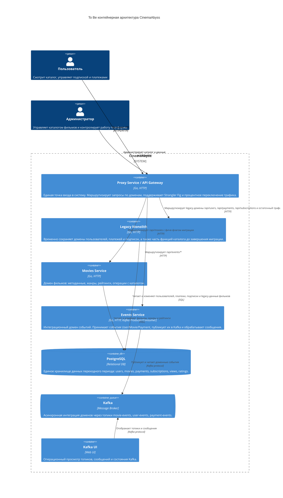

# Задание 1. To Be архитектура CinemaAbyss

## Контейнерная диаграмма C4

## Домены и ответственность

- **API Gateway / Proxy**: единая точка вызова всех сервисов, маршрутизация по доменным API, фасад для клиентов, постепенное переключение трафика с монолита на микросервисы.
- **Movies**: каталог фильмов, метаданные, жанры, рейтинги и будущая изоляция всех операций с фильмами.
- **Users**: пользователи и регистрационные данные. На текущем этапе остается в монолите как отдельный домен-кандидат на выделение.
- **Payments**: платежи и статусы транзакций. На текущем этапе остается в монолите, но публикует/потребляет события через интеграционный контур.
- **Subscriptions**: подписочные планы, сроки действия и автопродление. На текущем этапе остается в монолите.
- **Events / Integration**: асинхронное взаимодействие между доменами через Kafka, публикация и обработка событий `movie-events`, `user-events`, `payment-events`.

## Интеграционное взаимодействие

- Синхронные клиентские запросы проходят только через **Proxy Service / API Gateway**.
- Вызовы `/api/movies` постепенно переводятся на **Movies Service** с помощью фиче-флага и процента миграции.
- Legacy-домены до выделения обслуживаются **Monolith**, но остаются явно разделенными по API и данным.
- События доменов передаются через **Events Service** и **Kafka**, чтобы новые сервисы могли интегрироваться асинхронно без жесткой связности.
