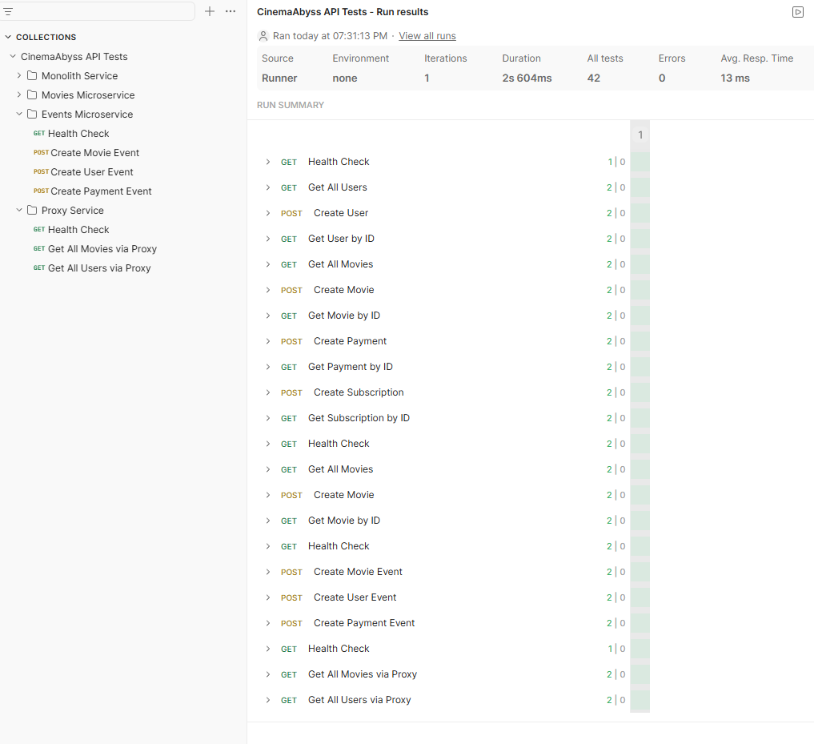
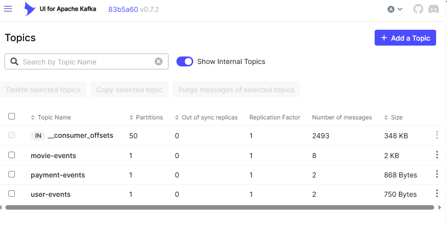

# Задание 2. Proxy и Kafka

## Proxy Service

Реализация находится в `src/microservices/proxy` и написана на Java 17.

Сервис работает как API Gateway и применяет Strangler Fig для маршрута `/api/movies`:

- `GRADUAL_MIGRATION=false` направляет `/api/movies` в монолит.
- `GRADUAL_MIGRATION=true` направляет процент запросов в `movies-service`.
- `MOVIES_MIGRATION_PERCENT` задает долю трафика для нового сервиса от `0` до `100`.
- остальные API по умолчанию проксируются в монолит.
- `/api/events/*` проксируется в `events-service`.
- `/health` возвращает `{"status":true}`.

## Events Service

Реализация находится в `src/microservices/events` и написана на Java 17.

Сервис предоставляет API:

- `GET /api/events/health`
- `POST /api/events/movie`
- `POST /api/events/user`
- `POST /api/events/payment`

При POST-запросе сервис создает событие, публикует его в Kafka и читает события из Kafka consumer'ами внутри этого же процесса с записью обработки в лог.

Используемые топики:

- `movie-events`
- `user-events`
- `payment-events`

## Скриншоты

- Тесты

- Состояния топиков Kafka
